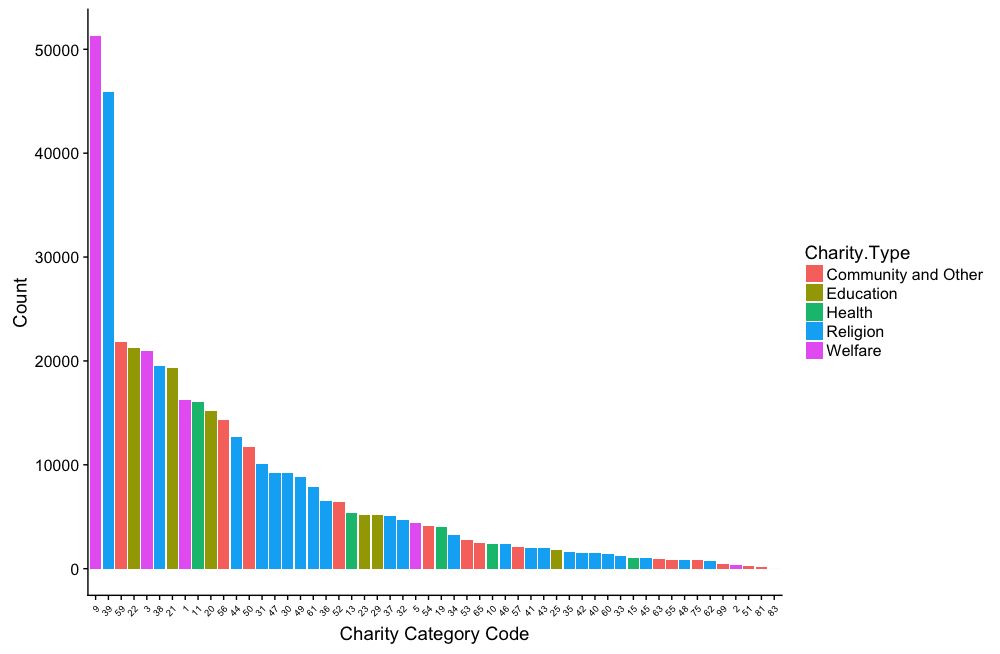
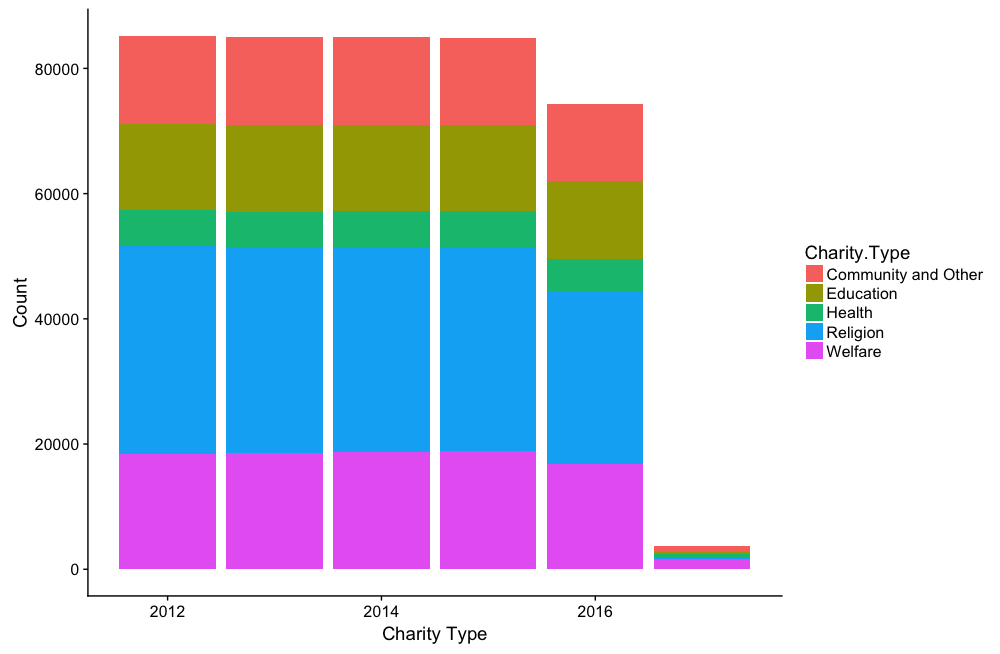
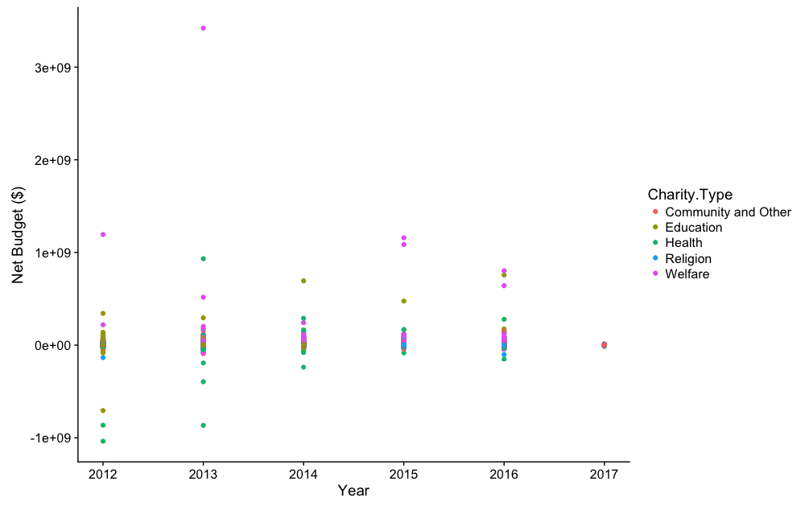

# Charity Types and Size Exploration

## Introduction
### Team 4: Text and Natural Language Processing
Q4E: `Are there trends or similarities in the way charities describe themselves? Do these serve to predict the size of an organization or its likelihood to get funded?`

Canada Revenue Agency Data on charities was used to classify the organizations. Charities can be classified descriptively in three ways, by `Designation`, `Category`, and `Type`.

There are three Charity Designations: Charitable organization, Private foundation and public foundation.

There are 55 Charity Categories that are associated with specific category codes (1 - 99 discontinuously).

There are 5 Charity Types: Community and Other, Education, Health, Religion and Welfare.

## Methods
Examined Canada Revenue Agency charity data to see if there are trends in the 1) types and 2) budgets of charities over the last 5 years.
* see the `charity_types_exploration.R` script for more details

## Results - CRA Charity Designations, Categories and Types

Table. CRA Charity organization total count by year.

**year**|**total**
:-----:|:-----:
2012|85180
2013|84949
2014|84997
2015|84873
2016|74345
2017|3734

### Charity Designations

Table. CRA Charity Designations by year.

**Year**|**Charitable organizations**|**Private foundations**|**Public foundations**
:-----:|:-----:|:-----:|:-----:
2012|74962|5133|5085
2013|74661|5213|5075
2014|74641|5296|5060
2015|74375|5464|5034
2016|65259|4642|4444
2017|3416|122|196

- The number of charities remained relatively stable between 2012-2015 but declined sharply in 2016 and 2017.

Table. CRA Charity Designations Year-Over-Year Change.

**Year**|**Charitable organizations**|**Private foundations**|**Public foundations**
:-----:|:-----:|:-----:|:-----:
2012|NA|NA|NA
2013|-301|80|-10
2014|-20|83|-15
2015|-266|168|-26
2016|-9116|-822|-590
2017|-61843|-4520|-4248

- There is a doubling of Private Foundation designated charities between 2014 and 2015.

Table. Comparison of `Private Foundation` Charity Type for 2014 and 2015.

**Year**|**Community and Other**|**Education**|**Health**|**Religion**|**Welfare**
:-----:|:-----:|:-----:|:-----:|:-----:|:-----:
2014|241|362|133|369|1525
2015|210|348|154|367|1630

- The majority (63%) of the increase in `Private Foundation` between 2014-2015 is due to an increase in organizations with a `Welfare` Charity Type.

### Charity Category Codes

Figure. Total CRA charity codes usage (2012-2017) coloured by CRA charity type.

### Charity Types

Figure. CRA charity types histogram by year.

Table. CRA Charity Types by Year

**Year**|**Community and Other**|**Education**|**Health**|**Religion**|**Welfare**
:-----:|:-----:|:-----:|:-----:|:-----:|:-----:
2012|14028|13763|5771|33178|18440
2013|14025|13805|5801|32721|18597
2014|14010|13769|5777|32691|18750
2015|13983|13680|5751|32576|18883
2016|12333|12463|5178|27528|16843
2017|902|364|506|243|1719

## Results - CRA Financial Data

**Caveats**: this analysis was done pretty quickly so I started by using annual reported `Total Revenue` and `Total Expenses` values and excluded organizations with NAs values that appear when calculating their `Net Budget` which in this case is `Total Revenue` minus `Total Expenses`. So I started with 418078 rows of data and was left with 389270 (93%).

Figure. CRA charities by `Net Budget` by year.

Table. Top 20 largest charities by total annual `Net Budgets`.

**Legal.Name**|**City**|**Province**|**year**|**Total.budget**
:-----:|:-----:|:-----:|:-----:|:-----:
Mastercard Foundation|TORONTO|ON|2013|3420696082
Mastercard Foundation|TORONTO|ON|2012|1193461257
Mastercard Foundation|TORONTO|ON|2015|1158145016
THE AZRIELI FOUNDATION/LA FONDATION AZRIELI|MONTREAL|QC|2015|1084923711
VILLA DU REPOS INC.|SHEDIAC|NB|2013|932854989
Jewish Community Foundation of Montreal / La Fondation Communautaire Juive de MontrÈal|MONTREAL|QC|2016|802725827
THE HALIFAX GRAMMAR SCHOOL|HALIFAX|NS|2016|756188955
THE GOVERNING COUNCIL OF THE UNIVERSITY OF TORONTO|TORONTO|ON|2014|693268000
Mastercard Foundation|TORONTO|ON|2016|641181139
THE AZRIELI FOUNDATION/LA FONDATION AZRIELI|MONTREAL|QC|2013|516649475
THE GOVERNING COUNCIL OF THE UNIVERSITY OF TORONTO|TORONTO|ON|2015|475645000
Commission Scolaire Marie-Victorin|LONGUEUIL|QC|2012|342432243
THE GOVERNING COUNCIL OF THE UNIVERSITY OF TORONTO|TORONTO|ON|2013|294682000
Hamilton Health Sciences Research Institute|HAMILTON|ON|2014|289706000
VANCOUVER COASTAL HEALTH AUTHORITY|VANCOUVER|BC|2016|277890000
Fondation Marcelle et Jean Coutu|MONTREAL|QC|2014|242580019
THE AZRIELI FOUNDATION/LA FONDATION AZRIELI|MONTREAL|QC|2012|219004888
Fondation Lucie et AndrÈ Chagnon|MONTREAL|QC|2013|201529000
THE CALGARY FOUNDATION|CALGARY|AB|2013|179227583
UNIVERSITY OF BRITISH COLUMBIA|VANCOUVER|BC|2016|174574000

Table. Top 20 largest charities by annual `Total Revenue` in Alberta.

**Legal.Name**|**City**|**Province**|**year**|**Total.revenue...4700**
:-----:|:-----:|:-----:|:-----:|:-----:
GOVERNMENT OF THE PROVINCE OF ALBERTA|CALGARY|AB|2016|13816039000
GOVERNMENT OF THE PROVINCE OF ALBERTA|CALGARY|AB|2015|13665173000
GOVERNMENT OF THE PROVINCE OF ALBERTA|CALGARY|AB|2014|13067462000
GOVERNMENT OF THE PROVINCE OF ALBERTA|CALGARY|AB|2013|12518035000
GOVERNMENT OF THE PROVINCE OF ALBERTA|CALGARY|AB|2012|11690915000
THE CALGARY BOARD OF EDUCATION|CALGARY|AB|2016|1325699393
THE GOVERNORS OF THE UNIVERSITY OF CALGARY|CALGARY|AB|2016|1280420916
THE CALGARY BOARD OF EDUCATION|CALGARY|AB|2015|1257515811
THE GOVERNORS OF THE UNIVERSITY OF CALGARY|CALGARY|AB|2015|1243379430
THE GOVERNORS OF THE UNIVERSITY OF CALGARY|CALGARY|AB|2014|1211452895
THE CALGARY BOARD OF EDUCATION|CALGARY|AB|2014|1199444223
THE GOVERNORS OF THE UNIVERSITY OF CALGARY|CALGARY|AB|2013|1191091000
THE CALGARY BOARD OF EDUCATION|CALGARY|AB|2012|1187584890
THE CALGARY BOARD OF EDUCATION|CALGARY|AB|2013|1165391523
THE GOVERNORS OF THE UNIVERSITY OF CALGARY|CALGARY|AB|2012|1129622000
THE EDMONTON SCHOOL DISTRICT # 7|EDMONTON|AB|2016|1078834542
THE EDMONTON SCHOOL DISTRICT # 7|EDMONTON|AB|2015|1033542281
THE EDMONTON SCHOOL DISTRICT # 7|EDMONTON|AB|2014|985696824
THE EDMONTON SCHOOL DISTRICT # 7|EDMONTON|AB|2013|969266117
THE EDMONTON SCHOOL DISTRICT # 7|EDMONTON|AB|2012|913151727

##Discussion
* It is unclear what the source of the decline in the overall number of charities in 2016 and 2017.
  * Since the data is financial information the lack of data in these years may be related to reporting of tax data.

### Note
- The tables generated in this markdown document were created with this handy [Markdown Table Generator](http://jakebathman.github.io/Markdown-Table-Generator/).
