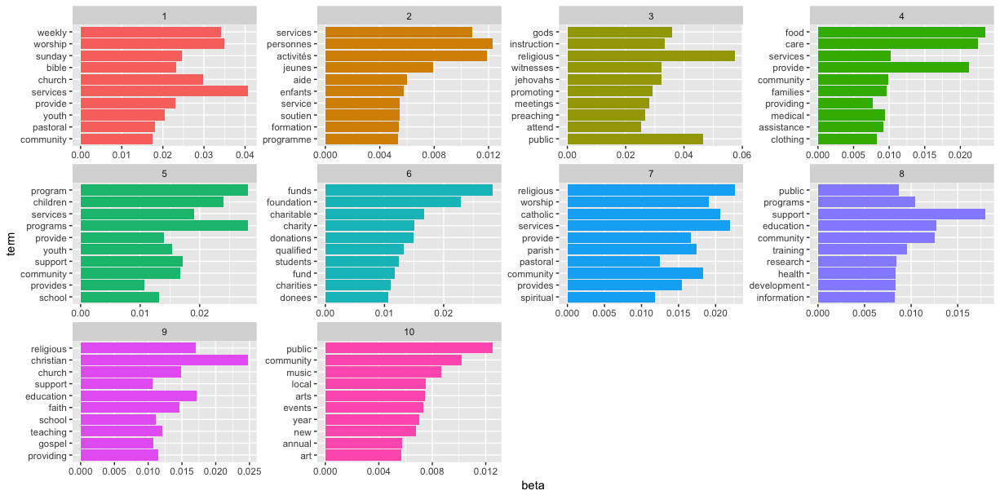
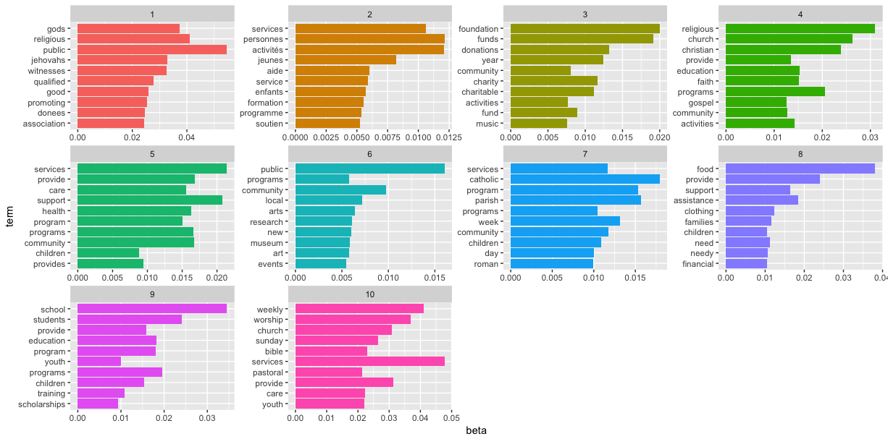
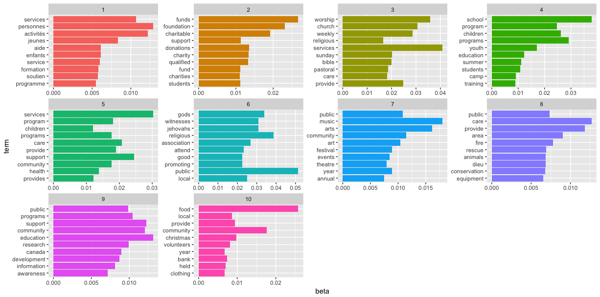
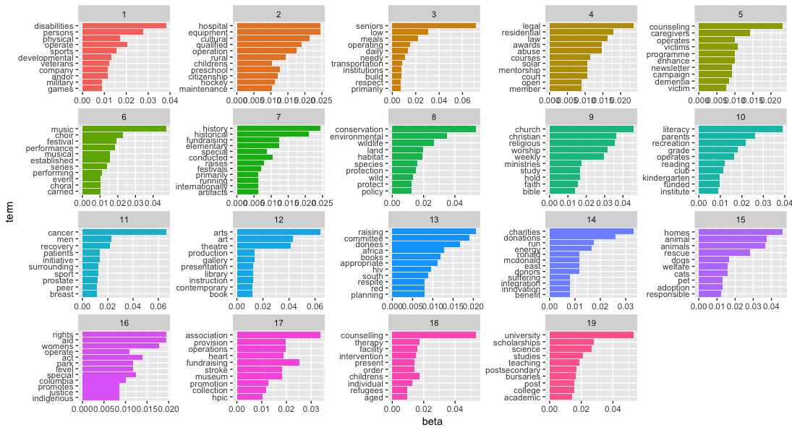
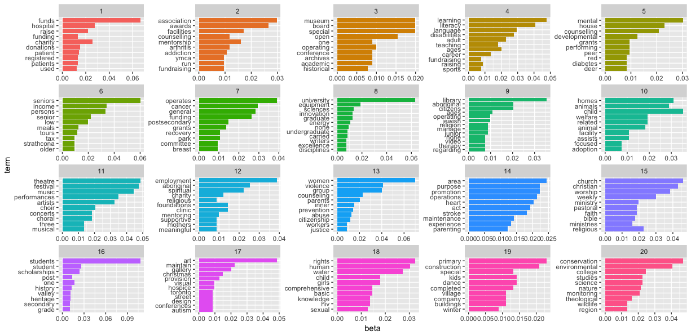
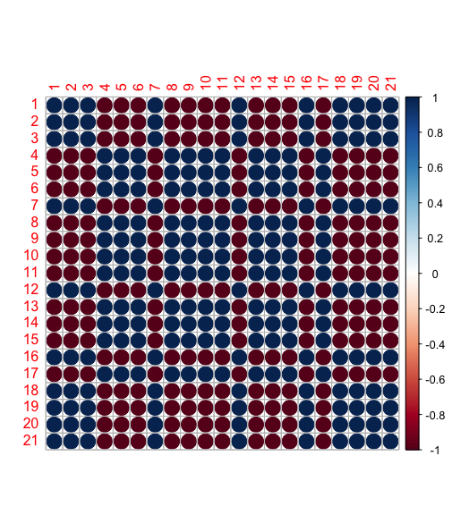

# LDA exploration (Topic modeling)

## Topic modeling for all charities
Created 10 topics LDA model for all charities (2012-216) and separate models for list of charities from 2012 and 2016 years. Removed most common french and english words (stopwords). Plots illustarate 10 most common terms within each topic - words with highest probability beta.
The most common areas  are  religion, family/community, education/research and music/art.

## Topic modeling for Calgary and Edmonton region:
Analysed list of successfull(Grant Approved) Calgary and Edmonton charites. As well as list of not successful(Grant Denied/LOI Declined) Edmonton Charities.

### Calgary
The optimal number of topics for successful Calgary charities is 19. 
Top 3 most common words for every topic are:
>1         disabilities persons operate
>2          equipment hospital cultural
>3                    seniors low meals
>4                legal residential law
>5        counseling caregivers victims
>6                 music choir festival
>7        history historical elementary
>8  conservation environmental wildlife
>9           church christian religious
>10         literacy parents recreation
>11                 cancer men recovery
>12                    arts art theatre
>13            raising committee donees
>14             charities donations run
>15                homes animal animals
>16                   aid rights womens
>17  association fundraising operations
>18       counselling childrens therapy
>19     university scholarships science

And 10 most frequent words:

Topics that stand out are  *willdlife conservation*, *dogs/cats/adoption*, *history/historical/artifatcs*. 

### Edmonton

#### Successful Edmonton charities 20 topics:
>1              funds hospital charity
>2       association awards facilities
>3                special museum board
>4          learning literacy language
>5            mental house counselling
>6              seniors income persons
>7             operates cancer general
>8       university equipment sciences
>9         library aboriginal citizens
>10                child homes animals
>11             theatre festival music
>12    employment aboriginal spiritual
>13               women violence group
>14             area purpose promotion
>15           church christian worship
>16      students student scholarships
>17               art maintain gallery
>18                 rights human water
>19         primary construction dance
>20 conservation environmental college

Top 10 terms:

Common topics for Calgary and Edmonton successful charities:
*funds/hospital*, *theatre/music*, *university/science*, *women/violence/aid*, *learning/literacy*, *seniors*, *cancer*, *homes/animal/adoption*,  *church/christian*, *conservation/environmental*.

#### Not successful Edmonton charities 18 topics:
>1           region experience special
>2              art aboriginal gallery
>3          learning literacy language
>4      counselling awards association
>5         festival music performances
>6                women violence group
>7         students university student
>8           seniors income employment
>9                cancer ages operates
>10           disabilities mental area
>11                  theatre one three
>12           church christian worship
>13                 child rights human
>14             funds general hospital
>15               operations heart act
>16             animals welfare animal
>17      primary construction maintain
>18 conservation environmental science

Top 10 terms:

Topics with somewhat different words: *special/experience/region*, *art/aboriginal/ gallery*. 

#### Successful/not successful charities combined:
>1             group parents maintain
>2   conservation environmental human
>3           animals safety promotion
>4  employment disabilities mentoring
>5           literacy special library
>6      cultural language counselling
>7                funds funding raise
>8     association purpose operations
>9                  child area mental
>10              artists art operates
>11     spiritual counselling history
>12            women violence college
>13       festival music performances
>14                theatre city three
>15         aboriginal house promotes
>16             church weekly worship
>17               related cancer kids
>18            seniors income persons
>19         hospital equipment grants
>20                home operate homes
>21   university science scholarships

 The most diagnostic topic for each of the categories: 0 - not successful charity, 1 - successful charity
 0  1 
 6 16 
 
 Correlation plot:
 
 
 Top 10 terms:

