# Tf-idf Exploration

The following is an exploration of the description text of charity programs from 2012 to 2017 via tf-idf scores. Very common words in either English or French ("and", "the", "a", etc.) were removed, along with overly lengthy words and other strange outliers that didn't seem to give any useful insight into differences among provinces or over years.

## Two approaches

Tf-idf penalizes words that appear most often in a set of documents, giving higher scores to more unique words that show up more often in a particular document.

Tf-idf analysis was done using both Province and Organization as the "document".

### Using Province as the document

Here we see the year to year differences among the provinces and territories, where words that are more unique to a particular province get higher tf-idf scores. One thing that stands out at this level is that we see a lot of geographic features, such as the names of towns and cities and the provinces themselves. This makes organization at the province level less useful, as it doesn't seem to tell us much about the actual charities.

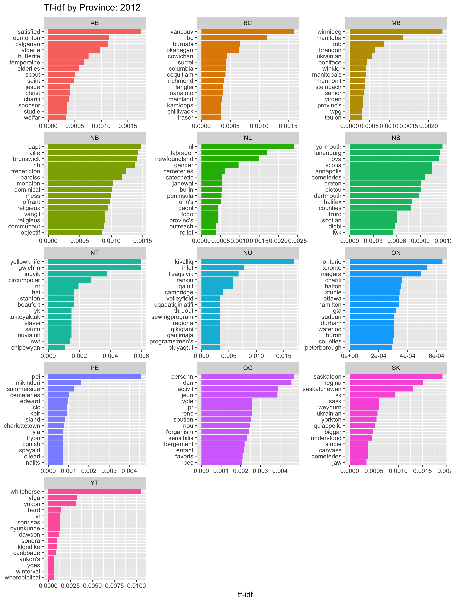
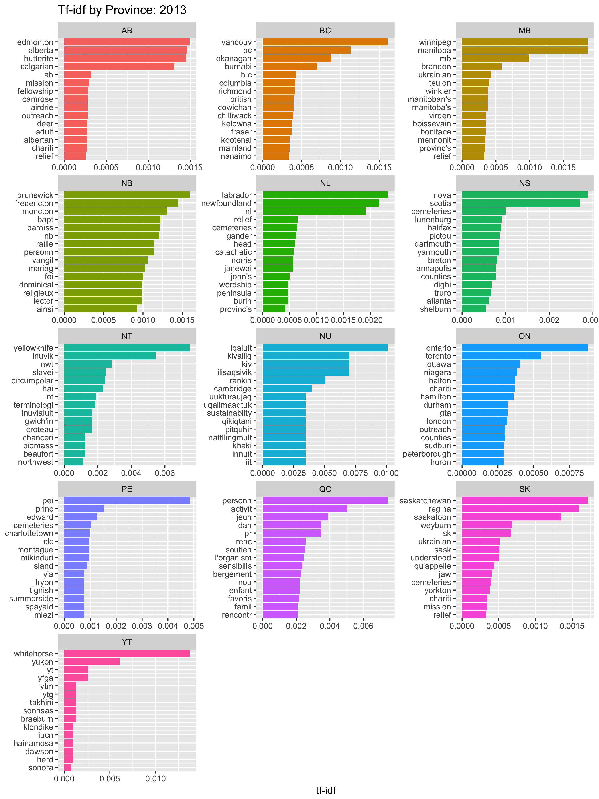
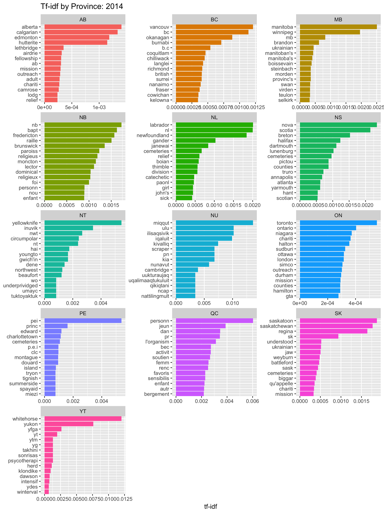
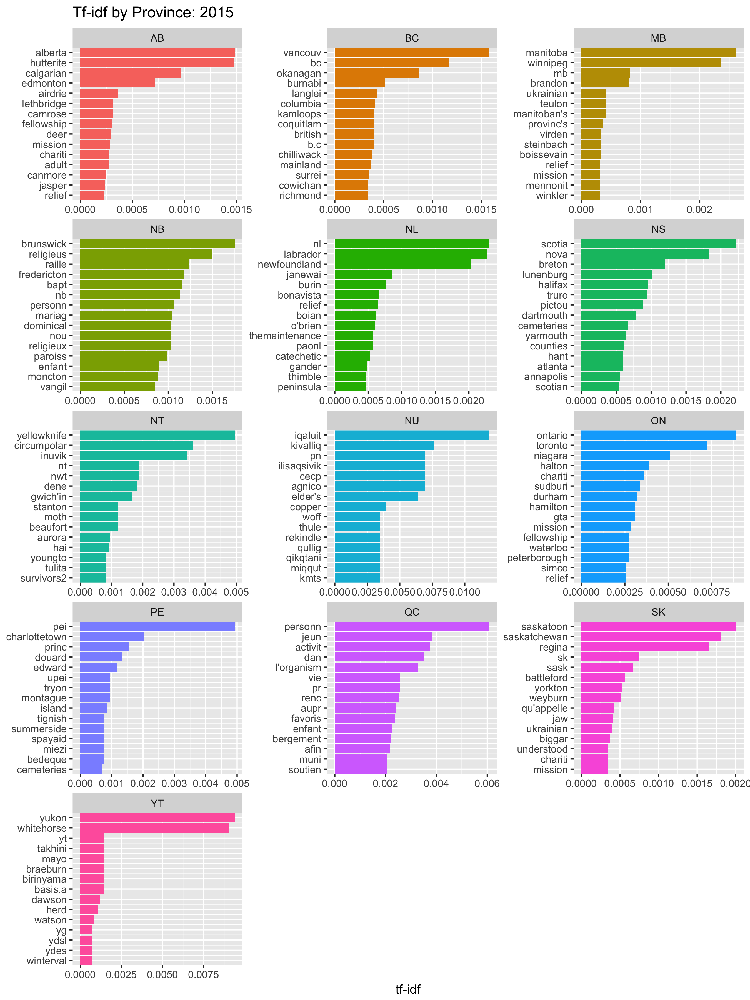
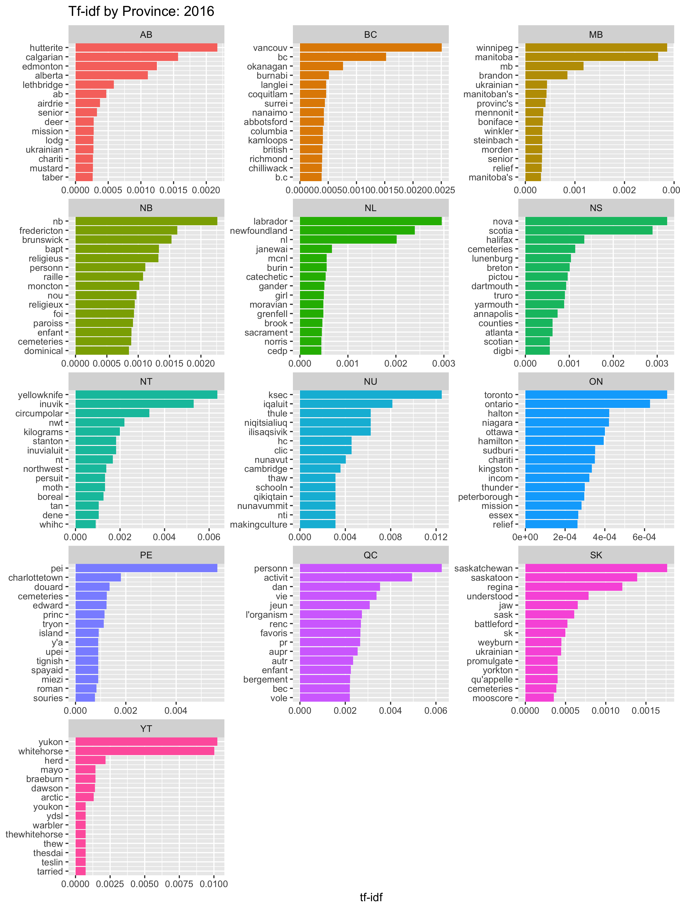
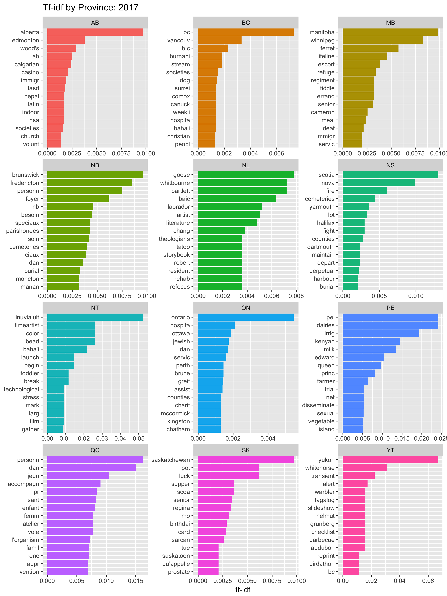

### Using Organization as the document

Here we use the different organizations as the documents. Thus words will be favoured that are unique to smaller subsets of documents. This seems to get us more information on the nature of charities in a particular province or territory. Note that we're still looking at everything for the entire province. In case we have multiple tf-idf scores for the same word in the same province under different organizations, we choose the maximum tf-idf score.

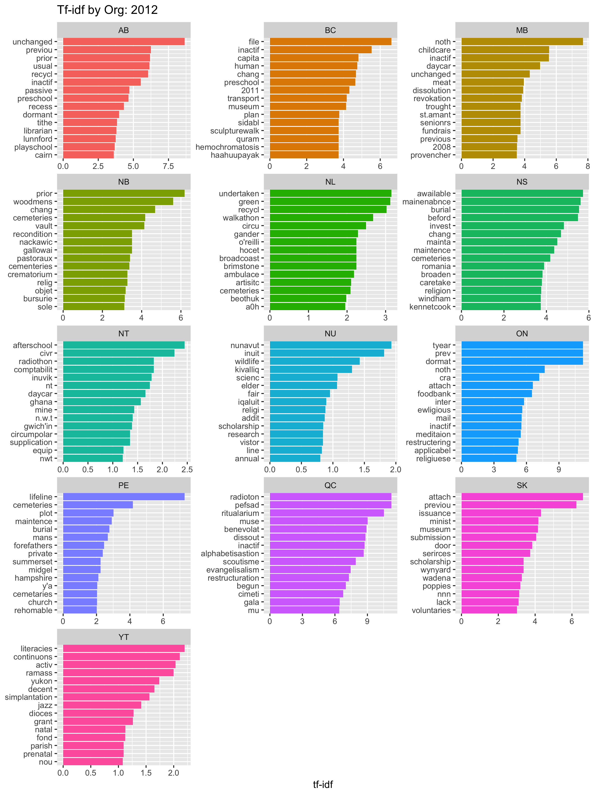
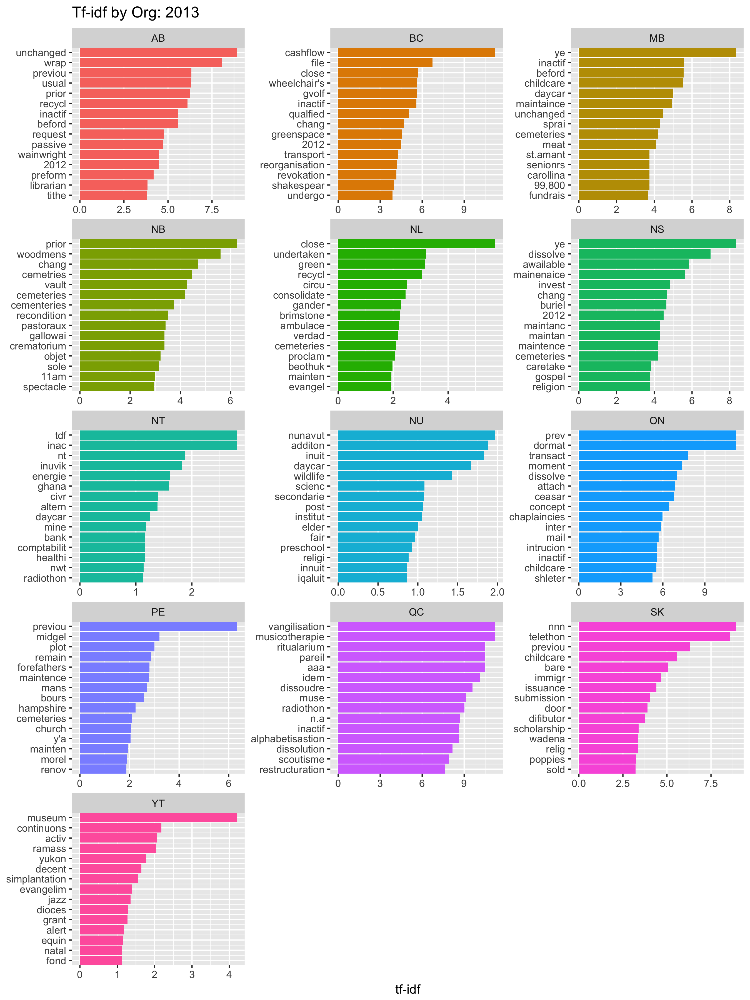
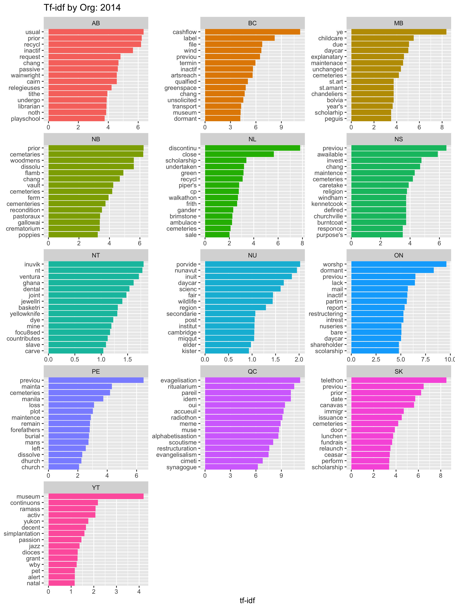
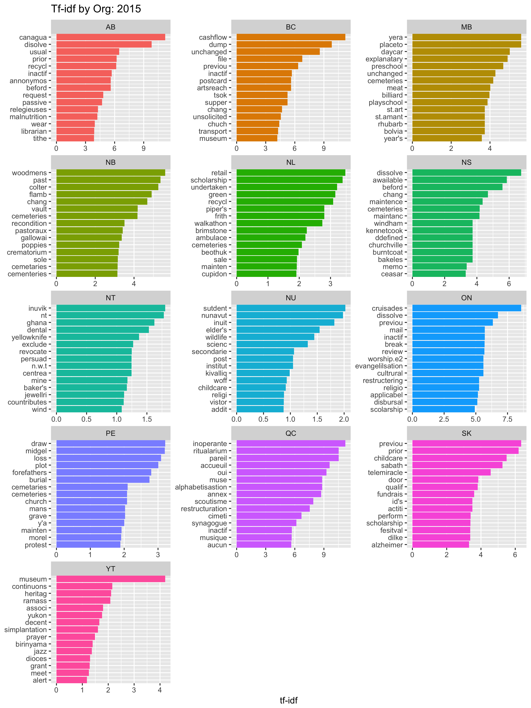
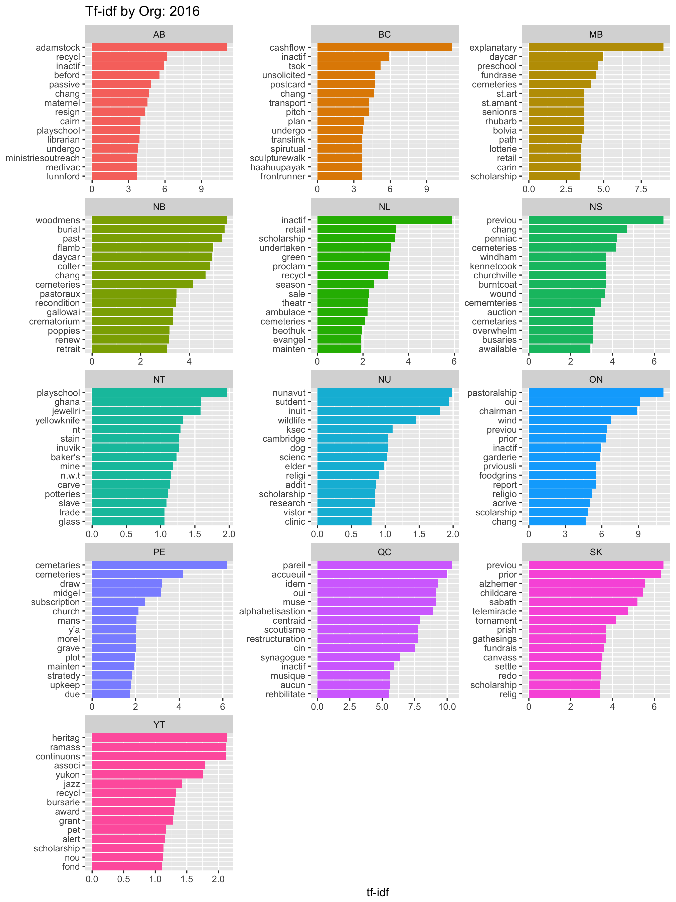
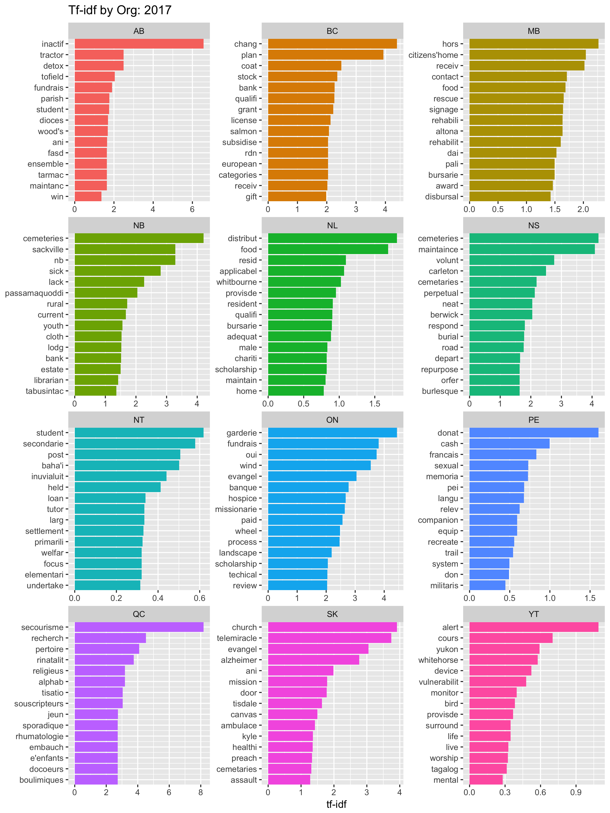